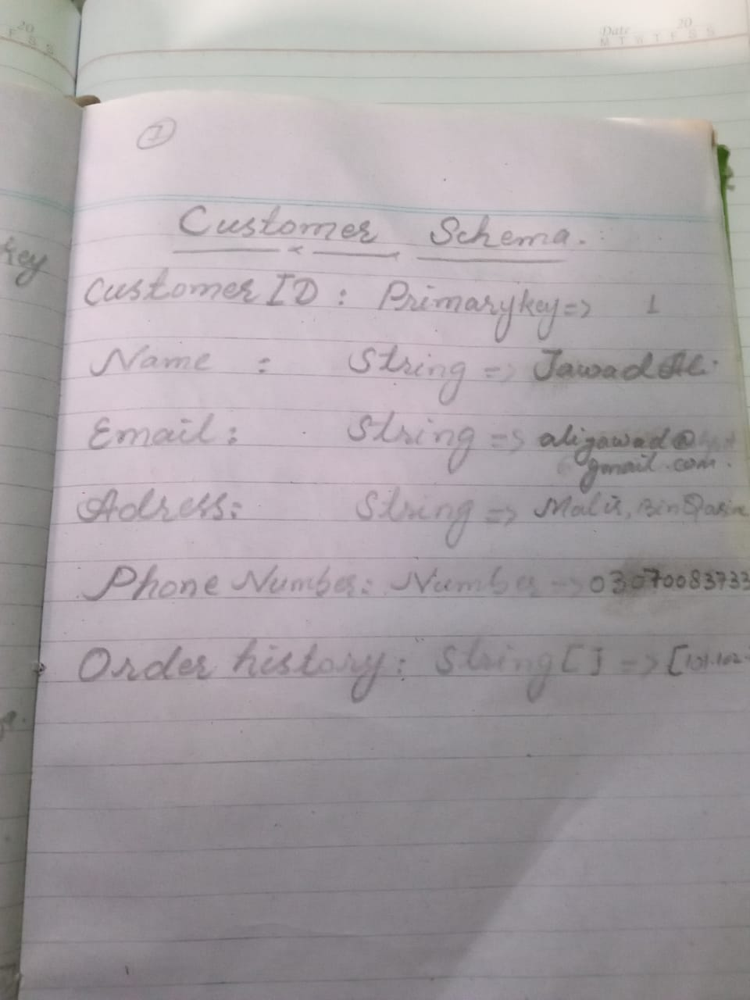
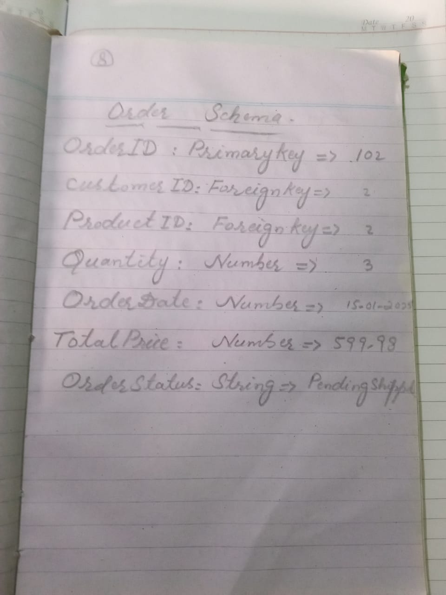
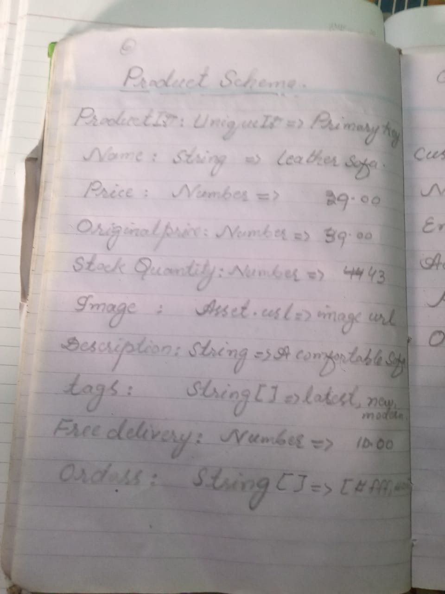
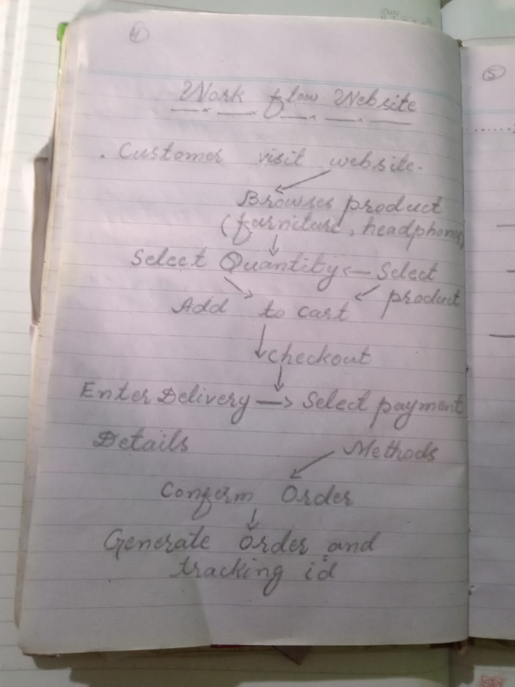
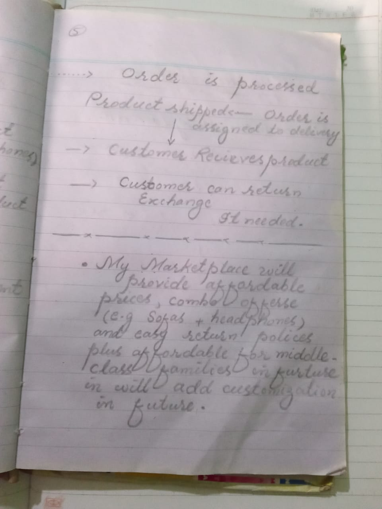

># Marketplace Builder Hackathon 2025 - Day 01 
Welcome to my **Day 1** submission for the **Marketplace Builder Hackathon 2025** This repository contains my work for laying the foundation of my e-commerce marketplace, which focuses on affordable furniture (sofas and chairs) and electronics accessories (headphones).

## Download the PDF
For a detailed overview of my Day 1 work with PENCIL AND PAEPR IN DETAIL , download the PDF here:

[PDF](k.pdf)

## Project Overview

 * **Marketplace Type: Niche E-Commerce**
 * **Focus Areas:** Furniture (Sofas, Chairs) and Electronics Accessories (Headphones)
 * **Unique Selling Points (USP)**

     - Affordable prices

    - Customization options for furniture

     -  Combo deals (e.g., Sofa + Headphones)

      - Fast and reliable delivery

## Business Goals

1.   Here are the key goals for my marketplace:

2. Problem to Solve: Provide customers with affordable furniture and electronics accessories on a single platform.

3. Target Audience: Young professionals, students, and middle-class families.

4. Products/Services: Sofas, chairs, and headphones (with plans to expand to home decor items).

5. Unique Features: Customization options, combo deals, and easy return policies.

 ### Workflow

 Here’s the workflow for my marketplace:

 ### Customer Visit

 * **Browses products** (Furniture, headphones)

 ### Select Quantity

 * **Selects products**

    - Add to Cart

     - Checkout

### Enter Delivery Details

* **Select payment method** 

### Confirm Order

* **Generate Order & Tracking ID**

### Order is Processed

* **Product shipped**

   - Order is assigned to delivery

### Customer Receives Product

* **Customer can return/exchange (if needed)**

## Data Schema

The data schema defines the structure of my marketplace. It includes the following tables:

## Products Table

| **Field**  |  **Type**  |  **Example**        |
|:-----------|:------------:|------------:|
| ***ProductID*** | ***UniqueID***  | ***PrimaryKey*** |
| ***Name***      | ***String***    | ***Leather & Medium***   |
| Price     | Numer     | 29.00   |   
| Original Price | Number | 39.00   |
| stock Quantity | Number | 43.00 |
| Image          | Assaet.url  |  Image (url)  |
| Description   |  Srting  |  A Comfortable  |
| Tgas         |   String []   | latest ,new ,modern  |
| Freedelivary |  Boolean  |  True|
| Color      |   String []   | Yellow, Green , Pink |

## Customers Table

| **Field**  |  **Type**  |  **Example**        |
|:-----------|:------------:|------------:|
| ***CustomerID*** | ***Primary***  | ***01*** |
| ***Name***      | ***String***    | ***Jawad Ali***   |
| email     | string     | alijawada63@gmail.com   |   
| Adress | String | Malir Bin Qasim   |
| Phone Number | Number | 03070083733|
| Order History | String []  |  101.102.0001 |

## Orders Table

| **Field**  |  **Type**  |  **Example**        |
|:-----------|:------------:|------------:|
| ***Order-ID*** | ***Primary-Key***  | ***102*** |
| ***Customer-ID**    | ***foreign-Key***    | ***02***   |
| Product-ID     | Foreign Key   | 02  |   
| Quantity-ID | Number | 03   |
| Order-Date | Number |2025-01-03 |
| Total-Price         | Number  |  599.098 |
| OrderStatus   |  String  |  Pending Shipped  |

## Delivery Zones Table

| **Field**  |  **Type**  |  **Example**        |
|:-----------|:------------:|------------:|
| ***Zone-ID*** | ***Primary ***  | ***01*** |
| ***Customer-ID**    | ***foreign-Key***    | ***02***   |
| Zone-Name    | String  | Street-15 |   
| Assigned-driver  | Sring [] | Ali Ahmed  |
| Estimated-delivery | String | 03-Days|

## Work Flow chart

The flowchart visualizes the connections between them:

